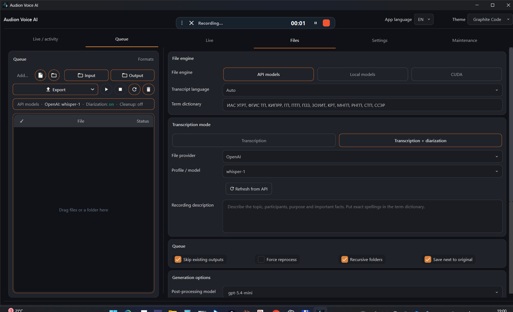

# Audion Voice AI Live

<!-- audion:release -->

  
  
  
  

**Version 2.1.2** · 2026-09-04 · 626.0 MB

- [Direct download](https://dl.audion.dev/voice-ai-live/2.1.2/Audion_Voice_AI_Live_v2.1.2_Full.zip) — unmetered, no rate limits
- [Project page](https://audion.dev/downloads/voice-ai-live) — every version and how to install

`SHA-256: 0dfa6c8e4c892a2908a5117bad10758901f625fa08c84634e97018105da9f32e`

---

An **Audion** tool, published by [Tensionix](https://github.com/Tensionix).
<!-- /audion:release -->

[Русский](README_RU.md) · [User Guide](USER_GUIDE_EN.md)

Transcribing recordings, live dictation, cleaning up text, and exporting working
notes. The light edition — for a laptop and everyday work.

## Why It Exists

Transcription is needed in two entirely different situations.

**Quickly, right now.** Dictate a paragraph, transcribe a ten-minute recording,
get the text immediately. Response time is what matters, and a cloud service fits
best.

**In bulk, offline.** An hour-long meeting, a whole day of dictaphone recording, a
folder of files. Here autonomy matters more: the recording should not leave the
machine, and the cost should not grow with every hour.

The program does both, and switching between them is a matter of choosing an
engine, not a different program.

## What Has to Be Installed Separately

**Model weights are not part of the distribution** — together they come to nearly
five gigabytes. The weights carry their own licences, separate from the program's,
so the user downloads them under their own account where that is required.

Until the models are installed, transcription will not start: the window opens,
but there is nothing to recognise with.

## Editions

| edition | for what | engines |
|---|---|---|
| **Live** | laptop, everyday work | cloud services, GigaAM, whisper.cpp |
| Studio | workstation with an NVIDIA card | the same plus CUDA and speaker separation |

Live is the main version. Studio adds heavy local engines and speaker separation
for machines with the hardware to run them.

## The Principle

**Reliable first, elegant second.** Batch transcription behaves predictably, and
everything else rests on it. An overlay on top of other windows and instant
on-the-fly parsing were both tried — and both broke the window itself. Heavy work
is not hung on the thread that draws the interface.

## What It Can Do

Transcribing files and folders, live dictation, cleaning up transcribed text,
exporting into working notes, a tray icon for quick access, resetting the
application to its initial state.

## Next

* [User Guide](USER_GUIDE_EN.md) — step by step, engines, formats.

---

## Technical Reference

### FFmpeg and the NVIDIA Driver

Every FFmpeg build is compiled against a particular version of the
hardware-encoding headers, and each demands its own minimum driver. The newest
build on an old driver does not accelerate anything — it breaks the hardware path.
So the build is chosen to match the driver, not by version number.

### Portability

Application state lives in the project folder, not in the system. A separate
command returns the application to its initial state without touching the
downloaded models.
